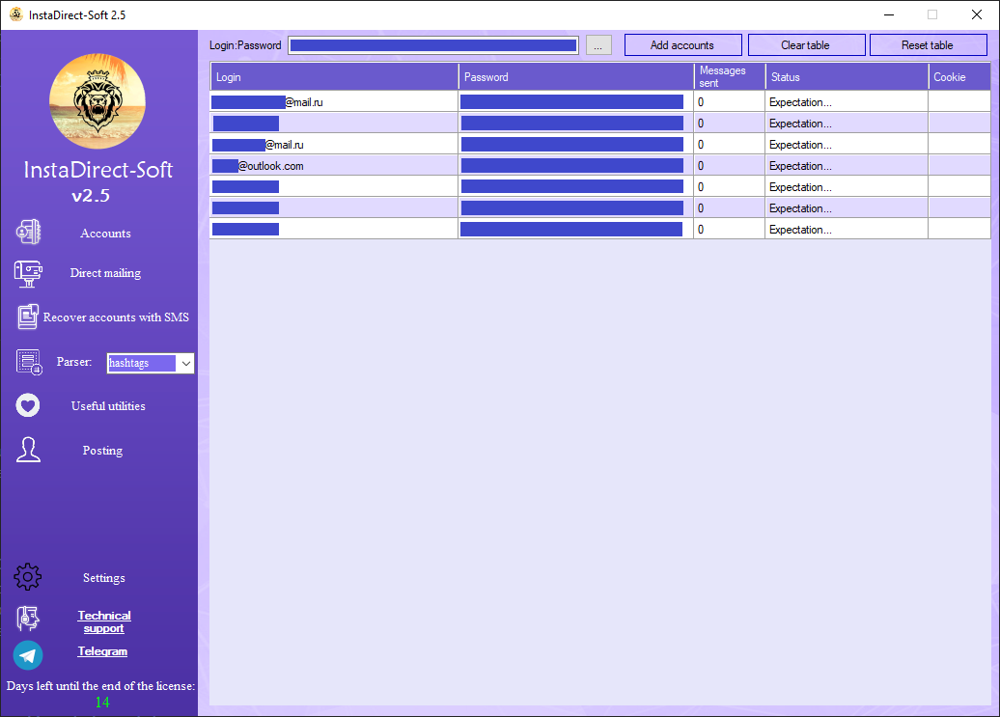

# InstaDirect-Soft

## Overview

**InstaDirect-Soft** is a powerful, feature-rich multi-tool for Instagram automation and account management. Developed in C#, this Windows desktop application leverages WinForms to provide a modern, user-friendly interface along with a host of advanced features. Whether you need to automate registrations, post photos, manage followers, or communicate via direct messages, InstaDirect-Soft has you covered.

## Key Features

### Instagram Automation
- **Registration Modules**
  - *WebRegistrar*: Automates web-based Instagram registration.
  - *ApiRegistrar*: Handles API-driven registrations.
  - *SMSWebRegistrar & SMSApiRegistrar*: Supports SMS-based registration methods.
- **Content & Engagement**
  - *PhotoWebPosting*: Automates photo posting to Instagram.
  - *MassFollowing*: Enables automated mass following.
  - *DirectMessage*: Facilitates sending direct messages.
- **Data Extraction & Management**
  - *HashtagsParser*: Extracts trending or target hashtags.
  - *GeoParser*: Retrieves location-based data.
  - *FollowersParser*: Collects information on account followers.
  - *FollowersGreeting*: Automates greeting messages for new followers.
- **Account Utilities**
  - *AccountChecker*: Validates account statuses.
  - *AvatarChanger*: Automates profile picture changes.
  - *AccountRecoverer*: Helps recover or manage existing accounts.
  - *UserAgentActualizer*: Keeps the user agent updated for optimal performance.
- **Maintenance & Cleanup**
  - *DeleteDuplicates*: Removes duplicate entries.
  - *DeleteCookies*: Clears stored cookies.
  - *BreakdownDB*: Provides database breakdown and maintenance utilities.

### Advanced System Features
- **Custom Licensing Mechanism**
  - Built-in licensing system based on hardware ID.
  - Supports flexible, time-based licenses.
- **Security & Integrity**
  - In-memory encryption of sensitive values.
  - Checksum verification for critical DLL libraries.
- **Auto-Update System**
  - Seamless auto-update functionality with a detailed changelog history.
- **Performance & Networking**
  - Multithreading support for enhanced performance.
  - Integrated proxy support (HTTPS/SOCKS) for secure, anonymous connections.
- **Localization**
  - Fully translated user interface available in both English and Russian.

## ConfuserEx protection

### About ConfuserEx
`ConfuserEx` ([old](https://github.com/yck1509/ConfuserEx) and [new](https://github.com/mkaring/ConfuserEx) versions) is a open-source protector for .NET applications.
`ConfuserEx` is one of the free open source obfuscators for .NET. Supports work in the Windows **.NET Framework** and **Mono environment**.
Contains a large number of modules implementing various methods of code protection (**renaming**, **obfuscation of the execution flow**, **encryption of resources and constants**, **protection from debugging and profiling, packers**).
`ConfuserEx` allows you to expand the functionality by writing your own protection modules. Open source code allows you to modify the protection system, change the obfuscator signature, thereby complicating the work of de-obfuscator programs and manual reverse engineering.

### ConfuserEx usage here
Since native compiled .NET applications are weakly protected from decompilation, I used `ConfuserEx` to protect my executable file from reverse engineering.
In combination with other security measures, such as the own `license system`, `DLL checksum verification`, `traffic encryption` and `in-memory value encryption`, this was a sufficient security measure.
And during the entire existence of the project, **it was never pirated**. And now it is openly available in this repository.

## Screenshots

Screenshots showcasing the main interface and various features can be found in the [InstaDirect-Soft/Screenshots](./InstaDirect-Soft/Screenshots) folder.

## Getting Started

InstaDirect-Soft is distributed as a Windows executable. Simply run the provided executable to launch the application. Detailed usage instructions and feature descriptions are available in the application's Help section.

## Auto-Update & Changelog

The application automatically checks for updates and provides a detailed changelog so you can keep track of new features, bug fixes, and improvements with every release.

## Licensing

InstaDirect-Soft includes a custom licensing mechanism that:
- Determines a unique hardware ID.
- Encrypts license details in memory.
- Validates the license period based on your selected license duration.

For more details or to manage your license, use the built-in **CheckLicense** functionality.

## Contributing

Contributions to InstaDirect-Soft are welcome. If you wish to improve or extend the project, please fork the repository, make your changes, and open a pull request. Contributions can include bug fixes, new features, UI enhancements, or improved documentation.

## Contact

For support, feedback, or inquiries, please reach out to me on GitHub. This is my old project, but still, feel free to communicate.

---

Happy Instagramming!
